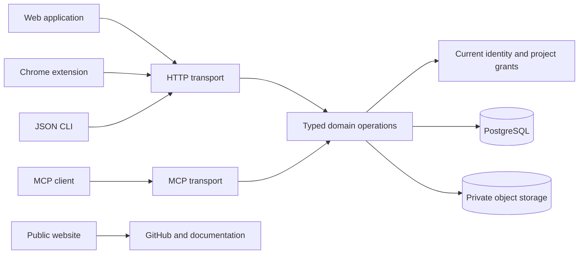

# Architecture

Feedbacks is a modular monolith with independently built clients. The domain service owns authorization and transactions. HTTP, MCP and the CLI use the same operation registry rather than implementing parallel business rules.

## Modules

- `config.ts`, `index.ts`, `db.ts`, `migrations.ts`: validated environment, process lifecycle, connection pool and serialized migrations.
- `auth.ts`, `accounts.ts`, `access.ts`: account lifecycle, credential boundaries and project access.
- `projects.ts`, `feedback.ts`, `views.ts`, `discussion-likes.ts`: review workflow and optimistic concurrency.
- `assets.ts`, `documents.ts`: image normalization, bounded WebM intake, private storage, project document review and authorized readback.
- `context.ts`, `export-limits.ts`: versioned instructions, stable bounded exports and change cursors.
- `operations.ts`: transactional operation dispatch. `app.ts` and `mcp.ts` handle transport concerns.
- `src/shared/contracts.ts`: discoverable operation input/output schemas and transport registry.

Client state is not authoritative. Database revisions detect stale writes; idempotency keys protect retries. Credentials are checked against current account state. Agents cannot become humans by selecting an input field.

## Deployment model

Use one codebase and separate runtime installations. A deployment represents one organization. Its owners can administer that organization's projects and members. Separate origins or object prefixes do not turn a shared database into a tenant boundary.

| Surface                   | Deployable artifact                    | Data boundary                                                         |
| ------------------------- | -------------------------------------- | --------------------------------------------------------------------- |
| Public website            | `dist/site` or `Dockerfile.site`       | Static content; no application database or credentials                |
| Team application          | `Dockerfile` + PostgreSQL + private S3 | One organization per database                                         |
| Hosted customer workspace | The same application image             | Separate database, object-store credentials and runtime configuration |
| Browser extension         | Versioned extension ZIP                | User-selected server and local connection state                       |

Organization-specific deployment inventory and secrets should live in a separate private infrastructure repository. A separate enterprise code fork is unnecessary for the current feature set and creates duplicated fixes. If commercial-only services are introduced later, keep their interfaces explicit and their licensing separate.

## Scaling boundaries

The public website can be cached independently. The application stores sessions, grants, feedback and cursors in PostgreSQL, with screenshot bytes in object storage. Database connection count is bounded by `DATABASE_POOL_MAX`; budget it across all replicas and operational clients. Transaction advisory locks serialize migrations and conflicting account/project operations.

Authentication throttles are currently in process memory. Start with one application replica. Before adding replicas, enforce a shared ingress throttle with verified client-IP handling, tune the total connection budget, exercise concurrent writes on real PostgreSQL, and measure latency, error rate, memory and image-processing capacity under representative traffic. Adding replicas alone does not establish high availability.

The account lock serializes domain database operations, including export construction. Image upload performs an initial authorization and revision check under the lock, decodes the image and writes to private object storage outside the lock, then rechecks current authorization and revision before committing metadata. A rejected upload removes its uncommitted object where the transaction outcome is known. An uncertain database commit preserves the private object rather than risk deleting a committed image; operators should monitor and reconcile orphaned private objects. S3 requests have a 15-second abort deadline; PostgreSQL statements have a 30-second timeout and lock waits a 10-second timeout. Export creation has persistent per-user/project/deployment attempt and active-snapshot budgets plus content-size limits; pagination reuses an immutable snapshot. This bounds amplification but is not a throughput benchmark. Large image decoding and exports consume application resources. Set ingress body/time limits, monitor load and add bounded asynchronous processing only when measurements justify it. Retention, backups and restore objectives are deployment decisions; no automatic deletion policy is enabled.

Shared-database multi-tenancy would require tenant-scoped identity, tenant predicates on every query, tenant-aware tokens and cache keys, isolation tests and a migration plan. This release does not claim those properties.

## Mechanically checked runtime boundaries

`npm run check:harness` parses literal runtime imports with the existing esbuild dependency. Shared modules depend on shared modules and Zod; server and web modules depend on their own layer and shared contracts; extension and site code stay inside their independently packaged directories. CLI modules use CLI/shared code, with these existing narrow exceptions:

- `src/cli/bootstrap.ts` imports server config, database, migrations and authentication for the explicit operator entry point.
- `src/cli/client.ts` and `src/cli/feedbacks.ts` reuse the server's `DomainError`.
- `src/cli/mcp.ts` reuses the server MCP adapter, passing the HTTP client as its executor.

These exceptions are exact file-to-file edges in [the checker](../scripts/lib/harness.mjs), not permission for arbitrary CLI imports into server internals. Extending one requires a documented reason and a regression test. The check excludes type-only and computed imports; review those explicitly. Internal domain layering within `src/server` remains a review responsibility.
