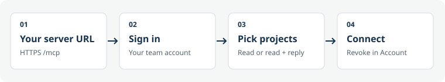

# Connect to your own server with OAuth

OAuth is optional. Existing local plugins and scoped API keys still work. With a compatible HTTP MCP client, connect to **your installation's** `https://feedback.example.com/mcp`, sign in and select projects. Each installation handles its own accounts, consent and credentials.



## Enable and connect

Set `MCP_OAUTH_ENABLED=true` in the installation's private `.env` or orchestrator environment. Keep `APP_ORIGIN` equal to the exact public HTTPS origin. Production Compose files forward the flag; it defaults to `false`. Deploy with your normal backup/release process. For a source build:

```sh
docker compose up -d --build --no-deps app
curl -fsS https://feedback.example.com/.well-known/oauth-protected-resource/mcp
curl -fsS https://feedback.example.com/.well-known/oauth-authorization-server
```

For registry Compose, use a reviewed image including this feature, then `docker compose -f compose.registry.yaml up -d --no-deps app`. Discovery must name this installation's `/mcp` resource and origin. HTTP is only for loopback development. Do not cache account/OAuth routes. Apply shared ingress rate limits for multiple replicas.

For a Codex CLI version supporting HTTP MCP OAuth:

```sh
codex mcp add feedbacks-oauth --url https://feedback.example.com/mcp
codex mcp login feedbacks-oauth --scopes feedbacks:read,offline_access
```

For Claude Code:

```sh
claude mcp add --transport http feedbacks-oauth https://feedback.example.com/mcp
```

Open `/mcp` in Claude Code and choose its authentication action. Check client help if commands differ. Keep one connection active for a task to avoid duplicate tools. Verify actual discovery and a permitted thread/image read before starting work. OAuth does not install the [workflow skills](agents.md).

Consent displays the client-provided name and **full registered callback**. Approve the request you initiated, choose projects and optionally allow replies. A display name is not proof of client identity. Declining sends no grant. Extension pairing is separate.

| Scope             | User approves                                               |
| ----------------- | ----------------------------------------------------------- |
| `feedbacks:read`  | Read feedback, evidence and context in selected projects    |
| `feedbacks:reply` | Optional replies; every selected project needs write access |
| `offline_access`  | Refresh without sign-in, subject to expiry/revocation       |

OAuth never grants owner administration, resolution, assignment, uploads or external GitHub writes. Current account/project permissions apply on every operation. Revoke under **Account → Connections**. Password change/reset revokes credentials and outstanding approved codes.

## Protocol and lifecycle

Public-client dynamic registration, mandatory S256 PKCE, exact registered redirects and canonical resource binding are implemented. Discovery advertises RFC 9207 issuer identification; successful and declined callbacks include this installation's issuer. HTTPS callbacks and native HTTP loopback callbacks are accepted. No client secret is issued. Errors never redirect to an unregistered destination. If callback navigation does not open your client, copy the approval screen's **Return to agent** link into the client's callback prompt.

Access tokens last one hour. Rotating refresh tokens expire after 30 idle days and at most 90 days total. Refresh replaces the access token; clients must serialize refreshes. Reuse of a consumed code or refresh token revokes the connection and newer credentials. Lost responses require reconnecting. Account shows refresh-connection expiry separately from access-token expiry. Secrets are stored as hashes.

OAuth tokens work only at `/mcp`, not `/api/*` or another installation. Manual keys retain their original HTTP/CLI/stdio paths. Disabling `MCP_OAUTH_ENABLED` stops OAuth issuance and access; valid connections can resume if re-enabled. Revoke in Account for permanent invalidation. Preserve additive migration 29 and its tables during rollback.

This is OAuth authorization, not an OpenID Connect provider. It issues no ID tokens or verified-email claims. Clients requiring OIDC or verified-email workspace restrictions need a separate identity integration. Directory review and configurable customer-server approval remain the directory provider's decisions.

## Recovery and verification

| Symptom                   | Action                                                                               |
| ------------------------- | ------------------------------------------------------------------------------------ |
| OAuth disabled            | Enable the flag and recreate the app container                                       |
| `invalid_target`          | Use exact `APP_ORIGIN` plus `/mcp` as resource                                       |
| Callback/PKCE rejected    | Start fresh; preserve registered callback and S256 proof                             |
| Request expired           | Restart: requests last 10 minutes, approved codes 5 minutes                          |
| Reply denied              | Request `feedbacks:reply`, select writable projects and approve replies              |
| Credential reused/revoked | Reconnect; never reuse the previous refresh token                                    |
| Browser origin blocked    | Use a server/native client; arbitrary browser cross-origin API calls are not enabled |

[OAuth service](../src/server/oauth.ts), [HTTP routes](../src/server/http/oauth-routes.ts), [consent screen](../src/web/agent-connection.tsx), [real MCP SDK protocol/denial tests](../tests/oauth.test.ts) and [PostgreSQL concurrency tests](../tests/oauth-postgres.test.ts) are the implementation references. Run under Node 22.12+ or 24:

```sh
node --import tsx --test --test-concurrency=2 tests/oauth.test.ts
npm run test:postgres
```

Standards consulted on 2026-10-02: [MCP authorization](https://modelcontextprotocol.io/specification/2025-06-18/basic/authorization), [OpenAI authentication](https://developers.openai.com/plugins/build/auth), [remote review](https://developers.openai.com/plugins/deploy/app-review) and [Claude MCP](https://code.claude.com/docs/en/mcp).
