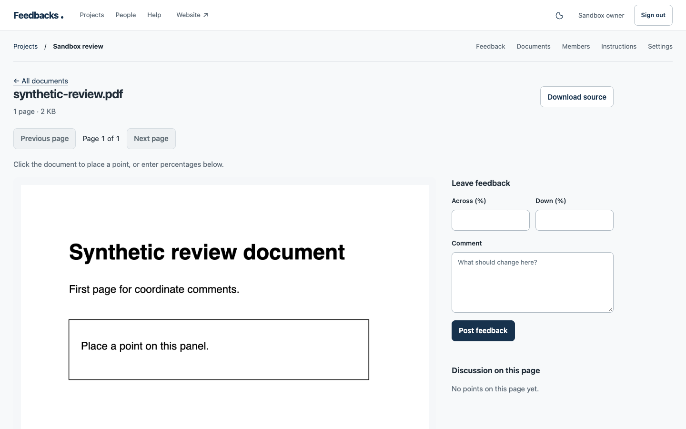
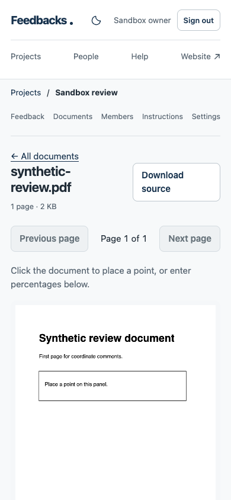

# Review a queue

Feedbacks is a shared place to clarify visual requests before they become agreed design or engineering work. [Why Feedbacks](why-feedbacks.md) describes that boundary.

## Move through threads

Filter a project's feedback, then open a thread. Search, status and sort stay above the list. Open **More filters** for page URL, domain, hostname, device, category and tag; active advanced filters reopen when the view loads. **Previous thread** and **Next thread** follow the same search, website, device, category, tag and sort settings, including across list pages. Left/right arrow keys do the same when focus is outside text fields, selectors, sliders and modal dialogs. Unsaved drafts still trigger the normal leave-page warning.

Neighbors stay fixed while you edit the current thread, so posting a reply or resolving it does not change the button under your hand. The next thread loads the current queue order. This is a live review list, not a frozen batch; another person's edits can change later positions. A direct link without filters uses the default unresolved activity list. Threads outside those filters show that state rather than guessing a neighbor.

## Update work status

The status selector at the top of a thread saves as soon as you choose a state. **Resolve** closes the thread in one click for members with resolution permission; **Reopen** opens it again. Notes are optional. Use **Add a note or duplicate link** when there is extra context to record.

The status stays above the feedback. On a narrow screen the screenshot appears before the review round, queue navigation and discussion. On desktop those controls sit beside the evidence. Open **Review** when a human sign-off is needed. The top actions open category and tags, a guest link, or linked issues in Details; the discussion remains the default pane. Icon actions have labels on hover and keyboard focus.

Project lists also show a status selector on each row. Changing it saves immediately, with resolution options only for members who can resolve threads. Dates throughout the app display in 12-hour IST format.

The saved status remains visible while a request is pending or fails. Failed updates retain their selection and details for retry. A conflicting revision must be loaded before retrying; the app does not silently overwrite another member's changes. Status history still records the actor and time. Resolving a thread does not claim delivery evidence or change its response obligation.

## Record a review decision

Review rounds record an explicit human decision separately from work status. A project writer can choose **Approve this round** or **Request changes**, with an optional note. The decision records the reviewer, time and round. **Open another round** increments the round number and preserves earlier decisions. An approval does not resolve the thread or assert that work is deployed. Agent keys cannot record a human sign-off. The thread revision prevents concurrent decisions from overwriting one another.

## Invite a guest to one discussion

A signed-in project maintainer can open a thread's **Guest discussion links** section, create a private link and share it with a client when [Cloudflare Turnstile is configured](self-hosting.md). The link is scoped to that one thread, expires after 1, 7 or 30 days and can be revoked at any time. The token appears only once in the web app. Its server record stores a hash, not the token. At most ten links can be active for one thread, and each link permits up to 50 replies. Each guest reply must pass server-side Turnstile verification.

The guest sees only the original feedback text and project name. The guest can submit a name and reply without an account. Screenshots, existing replies, internal notes and reviewer guidance are not shown. The reply appears in the team's discussion as a guest request; it does not change work status or record a review sign-off. Treat the link as private and revoke it when review is over. Guest screenshot capture is not available.

## Invite a guest to submit new feedback

A project maintainer can create a **Guest feedback link** in project settings when Turnstile is configured. It permits new feedback only: the guest sees the project name and a form for name, page URL and feedback, with no access to existing threads, screenshots, member notes or reviewer guidance. The submitted page URL must match an approved project origin unless the project accepts any website. New feedback appears as an untrusted guest request in the project's inbox. The form does not capture a screenshot or know the reviewed page's viewport; stored context marks its viewport as unknown.

Choose an expiry of 1, 7 or 30 days and a limit of 1 to 50 submissions. Up to ten unexpired links with capacity can remain active per project. The token appears once, only as a private URL fragment, and only its hash is stored. Maintainers can list submission counts and revoke a link. Each submission passes a server-side Turnstile check and an IP rate limit. A spent, expired or revoked link cannot accept further feedback.

## Add the website widget

In project settings, choose **Website widget** when creating a guest feedback link. The project must use exact approved origins. Copy the one-time script snippet into an approved website. The script shows a fixed **Send feedback** launcher; it does not load existing project feedback. The form sends the current page URL, viewport dimensions, visitor name and feedback. The host script does not capture screenshots or other tabs. Use the Chrome extension for private screenshot review.

Widget links use the same expiry, submission limit and revocation controls as guest links. A widget token cannot open the standalone guest form. The service answers widget requests only for an exact approved `Origin`, verifies the page URL matches that origin and checks Cloudflare Turnstile on the submitting website. The snippet token is visible to anyone who can inspect the host website, so it is a bounded public capability rather than a private invitation. Use a short expiry and low submission limit for public sites.

## Optional organization

Category defaults to General. Tags are optional, case-insensitive and shared with the thread. Use up to 12 tags, each 32 characters; letters, numbers, spaces, hyphens, underscores and slashes are accepted. The app and extension both allow tags when creating feedback. Project writers can update them afterward. Changes use the thread revision, so concurrent edits cannot silently overwrite each other.

Use **Saved views** to apply a named filter. Open **Save or remove a view** for less frequent maintenance. Views belong to you within a project, including for read-only project members. Other members cannot see or alter them. Each person can save up to 30 views per project. To revise a saved view, apply it, change filters, save a replacement and remove the old view.

## Compare attachments

For an existing thread with two private images, a maintainer can choose a baseline and any project member can calculate a pixel-difference percentage against another equal-sized image. Review the side-by-side or overlay image before deciding whether a change matters. See [scheduled page QA and visual baselines](scheduled-qa.md) for the limits of static scans and visual comparisons.

A thread with an image offers **Visual baseline and comparison**. With two or more screenshots, pick any two attachments for side-by-side comparison. Equal-sized images also support an overlay slider. Different dimensions stay side by side without stretching. Equal dimensions do not establish that two captures show the same page position.

An explicitly recorded tab video appears in the thread's attachments with playback controls. Video is excluded from screenshot comparison. Teammates need current access to the project to load it.

## Review a PDF or image

Open a project's **Documents** tab. A signed-in maintainer can upload a PDF, PNG, JPEG or WebP up to 8 MiB; PDFs may have up to 25 pages. The server validates the file and records its PDF page count or normalized image dimensions before it becomes available. The original PDF is stored privately; images are normalized to WebP. Project members can open or download the source after the server checks their current grant.

Choose a PDF page, then click the page or image to select a point. Keyboard users can enter across/down percentages instead. Post a comment to create a normal feedback thread with the document, page and normalized position in its context. The document viewer shows numbered points and links to the full discussion. Replies, status, tags, human review and agent context use the same thread workflow as website feedback. Documents are not exposed to guest links. A document point does not claim to identify an HTML element or a webpage URL.

_Desktop viewer with a generated sample PDF. No customer file or discussion is shown._

_Mobile viewer showing the same generated PDF at a narrow viewport._

## Share diagnostics deliberately

In the extension popup, open **Console & network**, start collection, reproduce the problem and take a screenshot. Collection covers the top-level page from that moment until capture, stop, navigation or five minutes. Review the entries in the editor and explicitly enable sharing. See [extension privacy and limits](extension.md#optional-console-and-network-context).

Quick requests and discussion stay here. An agent with separately granted GitHub access can create an Issue after the team agrees and link its actual URL to the thread through MCP. Feedbacks does not automatically create or synchronize Issues.
