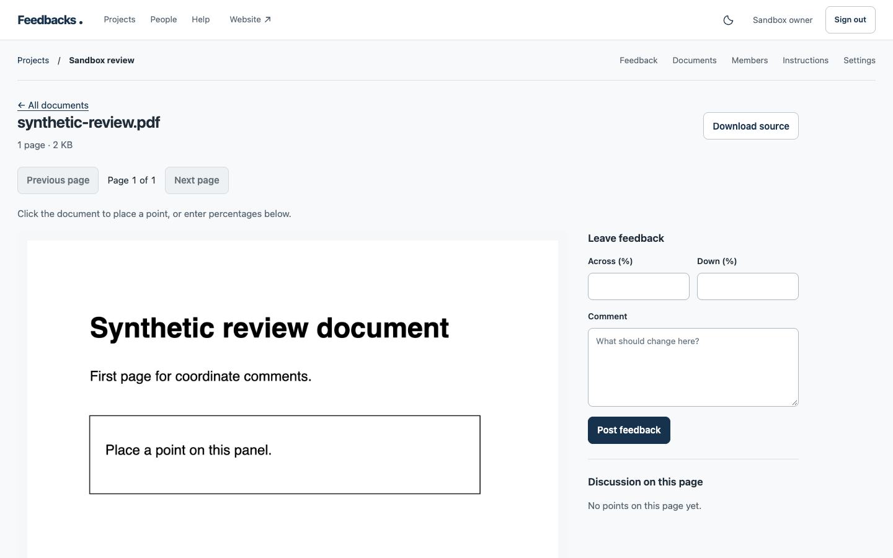
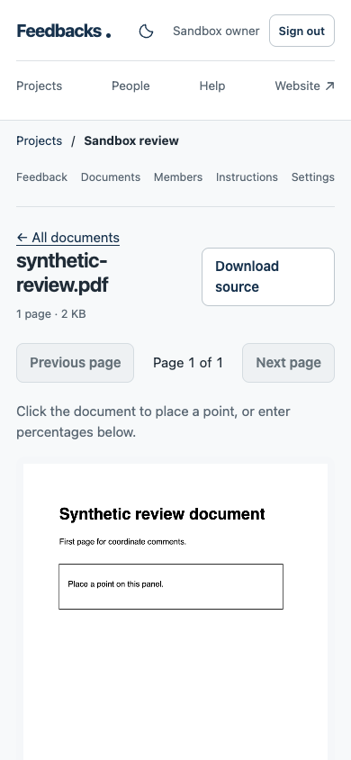

# Review a queue

Feedbacks is a shared place to clarify visual requests before they become agreed design or engineering work. [Why Feedbacks](why-feedbacks.md) describes that boundary.

## Move through threads

Filter a project's feedback, then open a thread. Search, category, tag, assignee, work status and sort stay above the list. Choose **Assigned to → Me** and **Work status → Open** to see only your actively assigned feedback whose thread status is exactly Open. **Active** includes Open, In progress and Ready for review; **Closed** includes Resolved and Declined; **All statuses** includes every work status. **Assigned to me** above the list toggles just the assignee filter, preserving the selected work status and sort. Assignment matches active whole-thread work or an assigned point that is still open. The summary's open-point count is separate from thread work status. Category and tag menus use that project's current names; selecting any menu option updates the list immediately. Search and page URL changes update after a short pause in typing. **Clear** resets the filters. Click a category or tag badge on any feedback row to filter the same page; click the selected badge again to remove that filter. The filter choices stay in the URL so a view can be shared or bookmarked. Open **More filters** for page URL, domain, hostname and device; active advanced filters reopen when the view loads. **Previous thread** and **Next thread** follow the same search, website, device, category, tag and sort settings, including across list pages. Left/right arrow keys do the same when focus is outside text fields, selectors, sliders and modal dialogs. Unsaved drafts still trigger the normal leave-page warning.

Neighbors stay fixed while you edit the current thread, so posting a reply or resolving it does not change the button under your hand. The next thread loads the current queue order. This is a live review list, not a frozen batch; another person's edits can change later positions. A direct link without filters uses the default unresolved activity list. Threads outside those filters show that state rather than guessing a neighbor.

Project maintainers can mark or unmark **Top priority** directly on a feedback row. The selected star is visible on the row, and the mark is included in thread reads for other project members and authorized agents. In the owner's **Top priority** sort, active marked threads come before active unmarked threads; weighted reviewer importance and view support still order threads within each group. Resolved and declined threads remain after active threads when all statuses are shown. Each click uses the thread's current revision, so a concurrent change produces a conflict to reload rather than overwriting it. The mark does not change work status.

## Update work status

Feedback rows show how many numbered points are resolved, with each point's original number, a text preview and **Open**, **Resolved** or **Closed** label. The first three appear directly in the list; **Show more points** expands the rest there without opening the discussion. Removed points are omitted without renumbering the remaining points. Select a point preview to open that point in its discussion, preserving the current filters. A resolved thread shows its remaining points as resolved; a declined thread shows them as closed. **Ready for review** does not imply that open points have been resolved. Replies alone do not change point completion.

The status selector at the top of a thread saves as soon as you choose a state. **Resolve** closes the thread in one click for members with resolution permission; **Reopen** opens it again. Notes are optional. Use **Add a note or duplicate link** when there is extra context to record.

The status stays above the feedback. On a narrow screen the screenshot appears before discussion and queue navigation. On desktop, discussion sits beside the evidence. The top icon actions open optional notes, review decisions, guest links, linked issues and details. A GitHub Issue action appears only after a maintainer connects this project to a repository; setup stays in project settings. On narrow screens menus open at the bottom of the viewport. Each icon has an accessible name and a label on hover or keyboard focus.

The original feedback places Like beside the first screenshot's dimensions when there is one, or beside the feedback text when there is no main screenshot. Category and tags sit below the original feedback as secondary details. Each discussion reply places Like beside its text, with small Edit and Delete icons to the right for your earlier replies. Their names appear on hover and to screen readers. Edit opens an inline composer with Save edit and Cancel; after saving, the original posting time remains and **Edited on** shows the edit time. Delete asks for confirmation, then removes that reply and its likes. These controls appear only for your own signed-in comments; the original feedback and guest or agent replies have no comment-management controls.

New projects start with the feedback queue, discussion and status. Document review and surveys/polls are off until a maintainer enables their tabs under **Project settings → Project → Optional tools**. Turning a tab off hides its project UI without deleting its saved documents or surveys. GitHub Issue creation likewise stays out of the thread until a repository is connected.

Project lists also show a status selector on each row. Changing it saves immediately. Resolved and Declined remain visible but are disabled with a permission label for members who cannot resolve threads. If a status change takes feedback outside the current filters, **Open feedback** keeps its discussion reachable and **Undo status change** restores the earlier state. Undo requires permission to restore the earlier state, uses the saved revision and preserves the earlier note and duplicate link; a newer edit causes a conflict instead of being overwritten. Recent dates use short relative labels such as “3 mins ago”; the full 12-hour IST date and time is available on hover or keyboard focus.

The saved status remains visible while a request is pending or fails. Failed updates retain their selection and details for retry. A conflicting revision must be loaded before retrying; the app does not silently overwrite another member's changes. Status history still records the actor and time. Resolving a thread does not claim delivery evidence or change its response obligation.

## Resolve or remove individual points

The thread shows its page capture first when one was saved, then lists the numbered points in order. Each point's original screenshot sits with its note and element details, with a link to open the full image. A point without a saved original can use a relevant page capture; when no image covers it, the note remains visible. Additional page captures are available below the main capture.

Each published point has its own decision. Members with resolution permission can **Resolve point** or **Reopen point** without closing its thread. Maintainers can **Remove point** and **Restore point**. Removal excludes it from active pins/counts but preserves its original note, element metadata, screenshot and audit history. Marks baked into a historical image remain visible. Removed points stay available under the thread’s Removed filter.

Resolving or declining a thread closes all its visible points without overwriting their individual decisions. Reopening restores the earlier decisions. Individual resolution does not automatically close a thread. When every active point is resolved, the point summary explains the remaining thread status and offers **Resolve feedback** to members who can resolve it. Use that action when the whole request is complete. Removed points do not count toward completion, and removing every point does not prompt resolution. Stale revisions require reloading, and every point decision records its author and time.

The extension shows open/resolved/closed point and thread totals for the selected page, hostname or device class. Totals cover all matching threads rather than the current pagination window. Links open the configured server with those filters. The list shows a direct website link, annotation count and counts of screenshots, videos and other files, excluding generated thumbnail copies.

## Record a review decision

Review rounds are off by default. A project maintainer can enable **Require a separate review decision** in project settings when formal sign-off is needed. A project writer can then choose **Approve this round** or **Request changes**, with an optional note. The decision records the reviewer, time and round. **Open another round** increments the round number and preserves earlier decisions. Turning review off again hides the decision control and preserves its history in thread details. An approval does not resolve the thread or assert that work is deployed. Agent keys cannot record a human sign-off. The thread revision prevents concurrent decisions from overwriting one another.

## Invite a guest to one discussion

A signed-in project maintainer can open a thread's **Guest discussion links** section, create a private link and share it with a client when [Cloudflare Turnstile is configured](self-hosting.md). The link is scoped to that one thread, expires after 1, 7 or 30 days and can be revoked at any time. The token appears only once in the web app. Its server record stores a hash, not the token. At most ten links can be active for one thread, and each link permits up to 50 replies. Each guest reply must pass server-side Turnstile verification.

The guest sees only the original feedback text and project name. The guest can submit a name and reply without an account. Screenshots, existing replies, internal notes and reviewer guidance are not shown. The reply appears in the team's discussion as a guest request; it does not change work status or record a review sign-off. Treat the link as private and revoke it when review is over. Guest screenshot capture is not available.

## Invite a guest to submit new feedback

A project maintainer can create a **Guest feedback link** in project settings when Turnstile is configured. It permits new feedback only: the guest sees the project name and a form for name, page URL and feedback, with no access to existing threads, screenshots, member notes or reviewer guidance. The submitted page URL must match an approved project origin unless the project accepts any website. New feedback appears as an untrusted guest request in the project's inbox. The form does not capture a screenshot or know the reviewed page's viewport; stored context marks its viewport as unknown.

Choose an expiry of 1, 7 or 30 days and a limit of 1 to 50 submissions. Up to ten unexpired links with capacity can remain active per project. The token appears once, only as a private URL fragment, and only its hash is stored. Maintainers can list submission counts and revoke a link. Each submission passes a server-side Turnstile check and an IP rate limit. A spent, expired or revoked link cannot accept further feedback.

## Run an opt-in survey

Open a project's **Surveys** tab as a maintainer. Create a short form with 0–10 recommendation (NPS), 1–5 rating, single-choice or written-answer questions. Mark individual questions required as needed. Set the link lifetime and maximum responses, then copy the one-time link. The questions are fixed for that link; create a new survey if the wording changes.

Visitors open the shared link in the Feedbacks app and complete a Turnstile check. The form asks for no name or email and does not reveal existing project feedback. Maintainers can inspect response counts, distributions and written answers in **Surveys**, and revoke the link. NPS is the percentage of 9–10 promoters minus the percentage of 0–6 detractors among answered recommendation questions. A score is absent until at least one recommendation answer exists. Survey responses remain separate from feedback threads.

Public links can be forwarded. Use short expiry and a modest response cap when sharing broadly. Turnstile must be configured for survey creation and submission.

## Add the website widget

In project settings, choose **Website widget** when creating a guest feedback link. The project must use exact approved origins. Copy the one-time script snippet into an approved website. The script shows a fixed **Send feedback** launcher; it does not load existing project feedback. The form sends the current page URL, viewport dimensions, visitor name and feedback. The host script does not capture screenshots or other tabs. Use the Chrome extension for private screenshot review.

Widget links use the same expiry, submission limit and revocation controls as guest links. A widget token cannot open the standalone guest form. The service answers widget requests only for an exact approved `Origin`, verifies the page URL matches that origin and checks Cloudflare Turnstile on the submitting website. The snippet token is visible to anyone who can inspect the host website, so it is a bounded public capability rather than a private invitation. Use a short expiry and low submission limit for public sites.

## Optional organization

Category defaults to General. Project maintainers can add, rename and archive custom categories in **Project settings → Categories & tags**. Renaming keeps the category ID and existing feedback; archiving removes it from new selections while preserving older feedback. Categories and tags appear together in project feedback rows and thread detail.

**Add category** creates a local draft. Choose **Save categories & tags** before
leaving settings to make it available in feedback filters and category selections.
The page shows when changes remain unsaved; fields pause while saving so later
typing cannot be discarded by the response.

Tags are optional, case-insensitive and shared with the thread. Use up to 12 tags, each 32 characters; letters, numbers, spaces, hyphens, underscores and slashes are accepted. In the app, choose an existing project tag or create one from feedback; the extension also accepts new tags during capture. Tags first used on a thread join that project's vocabulary with a stable subtle color. Maintainers can add unused tags and change any tag color in project settings. Project writers can update a thread's category and tags afterward. Thread edits use the thread revision, so concurrent edits cannot silently overwrite each other.

Use **Saved views** to apply a named filter. Open **Save or remove a view** for less frequent maintenance. Views belong to you within a project, including for read-only project members. Other members cannot see or alter them. Each person can save up to 30 views per project. To revise a saved view, apply it, change filters, save a replacement and remove the old view.

## Compare attachments

For an existing thread with two private images, a maintainer can choose a baseline and any project member can calculate a pixel-difference percentage against another equal-sized image. Review the side-by-side or overlay image before deciding whether a change matters. See [scheduled page QA and visual baselines](scheduled-qa.md) for the limits of static scans and visual comparisons.

A thread with an image offers **Visual baseline and comparison**. With two or more screenshots, pick any two attachments for side-by-side comparison. Equal-sized images also support an overlay slider. Different dimensions stay side by side without stretching. Equal dimensions do not establish that two captures show the same page position.

An explicitly recorded tab video appears in the thread's attachments with playback controls. Video is excluded from screenshot comparison. Teammates need current access to the project to load it.

## Review a PDF or image

Open a project's **Documents** tab. A signed-in maintainer can upload a PDF, PNG, JPEG or WebP up to 8 MiB; PDFs may have up to 25 pages. The server validates the file and records its PDF page count or normalized image dimensions before it becomes available. The original PDF is stored privately; images are normalized to WebP. Project members can open or download the source after the server checks their current grant.

Choose a PDF page, then click the page or image to select a point. Keyboard users can enter across/down percentages instead. Post a comment to create a normal feedback thread with the document, page and normalized position in its context. The document viewer shows numbered points and links to the full discussion. Replies, status, tags, human review and agent context use the same thread workflow as website feedback. Documents are not exposed to guest links. A document point does not claim to identify an HTML element or a webpage URL.

_Desktop viewer with a generated sample PDF. No customer file or discussion is shown._

_Mobile viewer showing the same generated PDF at a narrow viewport._

## Share diagnostics deliberately

In the extension popup, open **Console & network**, start collection, reproduce the problem and take a screenshot. Collection covers the top-level page from that moment until capture, stop, navigation or five minutes. Review the entries in the editor and explicitly enable sharing. See [extension privacy and limits](extension.md#optional-console-and-network-context).

## Issue handoff

Quick requests and discussion stay here. After the team agrees, a reviewer can prepare a bounded Issue draft, create an Issue in GitHub, Jira Cloud or Linear, and register its actual URL on the thread. Supported reported links use `https://github.com/ORG/REPO/issues/123`, `https://SITE.atlassian.net/browse/KEY-123` or `https://linear.app/WORKSPACE/issue/KEY-123` (with an optional title slug). Query strings, fragments and lookalike hosts are rejected. These patterns follow [Atlassian's Jira Cloud issue URL](https://support.atlassian.com/jira/kb/known-problems-with-viewing-requests-on-the-customer-portal/) and [Linear's issue URL example](https://linear.app/developers/graphql), checked on 2026-09-25.

Manually registered links are labeled by provider and remain **reported**, not remotely verified. The draft excludes screenshots, diagnostics, private member notes and reviewer policy; inspect its text before copying it to another service. An agent needs separate tracker access and an explicitly granted `threads.issueDraft` scope to use this path. A connected GitHub App also supports explicit, verified GitHub Issue creation and optional project-level status sync. Incoming feedback never creates Issues automatically.

## Continue agreed design work in Figma

A signed-in project maintainer can open **Figma design reference** in a thread's Details and register one Figma file URL. The link can point to a selected Figma node. Replace or remove it there as design work changes. The reference is visible to project members who can read the thread; Figma controls access to the file itself.

Registering the reference saves only the Figma file URL in Feedbacks. It does not import a design, copy the thread or screenshots into Figma, verify Figma permissions, or resolve the feedback. If a designer needs source material in Figma, review what can be shared and move it explicitly using their authorized Figma workflow.

## Archive and delete feedback

Open **Archive** above the feedback list to find archived threads. The thread header has **Archive thread** / **Unarchive thread** actions with an explanation before confirmation. Archive preserves screenshots, recordings, files, points, discussions, reviews and guest links.

Signed-in human project maintainers can select threads on the current list page and choose **Delete selected**, or choose **Delete thread** in a thread header. The confirmation lists the selected feedback and consequences. Deletion permanently removes thread-owned records, points, replies, reviews, attachments and guest discussion links; shared project documents and external GitHub issues remain. A changed thread requires reloading and reviewing the selection before deleting it. A pending GitHub issue creation must be reconciled first.

Deleting feedback shows a five-second toast for that action. The **Deleted feedback** panel appears only while current-object storage cleanup is pending or failed and refreshes while the list is open. Completing a manual cleanup retry also shows a toast; historical completed receipts never create a notification on page load. The service retains completed receipts for audit. Failed or pending cleanup survives server restarts; cleanup continues automatically after the page closes or the server restarts. **Retry file cleanup** checks failed work immediately. Each batch processes up to 12 objects. Archived feedback can be restored; deleted feedback cannot be restored in the app. Older storage versions, retention-locked copies, backups and already delivered external copies follow the operator's retention policy.

## Identify and expand capture evidence

Feedback rows show the evidence type: Text, Text edit, Screenshot, Full page,
Document, Video, Session recording or Video + session. Mixed evidence keeps its
relevant labels. Recording frames and thumbnails do not count as separate screenshot
captures. The recording section is absent when no session recording or video exists;
recording loading failures still offer their existing recovery information.

Choose **Review image** beside a screenshot, or click the screenshot, to open one
image review dialog. Reviewers with thread write permission can draw or revise
annotations with the visible tools; read-only reviewers see the image without editing tools.
Writable review starts in **Pan** so dragging or swiping navigates the image; choose
**Pencil** or **Circle** to draw.
Points, element outlines and text selection share visibility with the inline image.
Show/hide controls are available in both places. **Fit width**, **100%** and **200%**
control zoom; large captures scroll inside the dialog. **Open original file** opens
only the saved image, without browser-rendered evidence layers. Legacy annotations
saved into image pixels remain part of that image.

Point centers and marker sizes use the original screenshot's pixel coordinates in
both the thread and image review. Zooming or resizing scales the image and its
markers together; decorative borders do not change their positions. Saving drawn
marks preserves the original point geometry.

**Save annotations** updates the image and closes the dialog. **Cancel**, **Close**
and Escape discard unsaved marks and return directly to the thread, with no viewer
left underneath. A failed save preserves the draft for retry. Closing is disabled
while a save is in progress.

On desktop, clicking the backdrop also closes image review. A drag that starts
inside the dialog stays open, so image navigation and drawing remain safe. On
mobile the dialog fills the screen; use **Close**, **Cancel** or Escape.

Numbered points show a compact preview and **Expand / Collapse** to describe the
accordion action. Resolved, closed or removed states and any non-normal priority
appear beside the preview; the disclosure action is separate from work status. A
single-point thread starts expanded; multiple points start collapsed and can be opened independently.
Counts, the point filter, **Expand all** and **Collapse all** sit directly above the
point list, after the page captures. Bulk actions affect filtered points across pages. Subtle
open/close transitions respect the system reduced-motion preference. Lists show five points per page with Previous/Next controls
and retain their original numbering when filtered. Direct links reveal the target
point's page. Each expanded point shows feedback, a compact **Priority / Schedule**
row and its screenshot using the available panel width. Visibility controls and
**Review image** sit above that image. Resolve/remove actions stay in a separate
footer, and technical element details stay collapsed.
